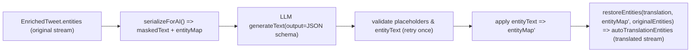
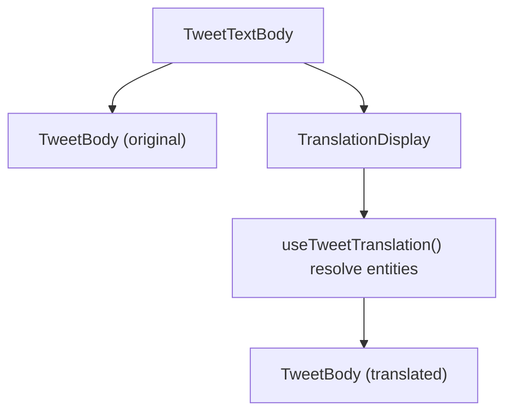

# 推文翻译与词典管理子系统设计文档 v2.0

> 本文档描述 **Anon Tweet** 当前（2026-03）翻译子系统的真实数据流向、关键约束与模块职责，并给出下一步重构边界。

## 1. 概述 (System Overview)

推文翻译子系统是 Anon Tweet 项目的核心业务模块之一，旨在为用户提供对推文内容（Text Entities）进行本地化重构的能力。该系统结合了 **Google Gemini AI** 的自动化翻译能力与 **人工编辑** 的精确控制，采用 **客户端主导 (Client-First)** 的状态管理策略。

本模块主要包含三个核心领域：

1.  **AI 自动翻译 (AI Auto-Translation)**：基于 Vercel AI SDK 和 Google Gemini 模型进行结构化输出翻译，并在服务端生成可渲染的 “翻译实体流”。
2.  **翻译编辑器 (Translation Editor)**：用户对实体级翻译进行人工校对、显示/隐藏管理（当前实现以“原始实体结构”为主）。
3.  **词典管理 (Dictionary Manager)**：维护本地术语表，用于 AI 提示词注入及 UI 辅助补全（如 hashtag 词典）。

### 1.1 术语与约束 (Terminology & Constraints)

- **Entity stream（实体流）**：`Entity[]` 按阅读顺序描述推文内容，包含 `text/hashtag/mention/url/...` 等类型。
- **Translated stream（翻译实体流）**：AI 翻译后重新构建的一套 `Entity[]`，允许占位符实体（hashtag/url/mention 等）在译文中 **重排** 以适配中文语序。
- **Overlay translation（覆盖式翻译）**：在不改变实体流结构的前提下，仅把 `translation` 字段回填到原始实体中（人工编辑与部分旧逻辑使用此模式）。
- **占位符 (Placeholder)**：AI 输入中把不可翻译实体替换为 `<<__TYPE_INDEX__>>`，AI 输出必须原样保留。

---

## 2. 领域模型 (Domain Model)

### 2.1 推文实体扩展 (Extended Entities)

系统在标准 `EnrichedTweet` 模型上扩展了翻译相关字段：

```typescript
interface EnrichedTweet {
  // ...标准字段
  entities: Entity[] // 原始实体流（保持只读；人工翻译存储在 TranslationStore）
  autoTranslationEntities?: Entity[] // 服务端 AI 生成的“翻译实体流”（可能与 entities 结构不同）
}
```

**关键点**：

- `autoTranslationEntities` 是“可直接渲染”的实体流，不保证与 `entities` 的长度/索引集合一致。
- 任何“按 index 合并回原文实体”的逻辑都必须谨慎，否则会出现 tag/正文错位。

### 2.2 翻译状态 (Translation State)

在 `TranslationStore` 中，翻译状态不仅仅是字符串，而是具有三态逻辑：

- **`undefined`**: 未进行人工编辑（默认状态，优先显示 AI 翻译，无 AI 则显示原文）。
- **`Entity[]`**: 已存在人工翻译/编辑内容（最高优先级）。
- **`null`**: 用户显式隐藏翻译（强制显示原文，忽略 AI 翻译）。

对应实现文件：`app/lib/stores/translation.ts`

### 2.3 翻译设置 (Settings Configuration)

管理翻译功能的全局行为及 AI 参数。

```typescript
interface TranslationSettings {
  enabled: boolean // 全局开关
  // AI 配置
  apiKey: string // Google Gemini API Key
  model: string // 例如 "models/gemini-2.0-flash-exp"
  enableAITranslation: boolean // 是否开启 AI 自动翻译

  // 显示风格
  customSeparator: string
  selectedTemplateId: string
  customTemplates: SeparatorTemplate[]
}
```

**Note**: `separatorTemplates` (presets) are fixed in the code and provided at the store root, while `customTemplates` are persisted in settings.

---

## 3. 状态管理架构 (State Management Architecture)

### 3.1 翻译业务 Store (`useTranslationStore`)

- **生命周期**: 会话级 (Session-based)，设置项持久化。
- **核心职责**:
  1.  **多级回退策略 (Fallback Strategy)**: 在渲染时，UI 组件会按照 `Manual Edit -> AI Translation -> Original Text` 的优先级决定显示内容。
  2.  **显式隐藏支持**: `setTranslation(tweetId, null)` 动作允许用户针对特定推文关闭翻译显示，此时系统会忽略 AI 翻译结果。
  3.  **数据同步**: `setTranslation` 只更新 `translations` 查找表；渲染/导出/同步时通过纯函数 “materialize” 将翻译覆盖到原文实体流，避免污染 `tweet.entities`。

### 3.2 词典持久化 Store (`useTranslationDictionaryStore`)

- **功能**: 管理用户自定义术语表。
- **AI 集成**: 词典内容会被序列化后作为 System Prompt 的一部分发送给 LLM，以提高特定领域名词（如二次元黑话、技术术语）的翻译准确度。

---

## 4. 核心业务逻辑 (Core Business Logic)

### 4.1 AI 自动翻译工作流（服务端）

为了解决 LLM 翻译过程中破坏推文实体（如 URL、Mention、Hashtag）的问题，系统设计了一套**占位符序列化机制**。

**实现文件**：

- AI 翻译入口：`app/lib/AITranslation.ts`
- 占位符序列化/还原：`app/lib/react-tweet/utils/entitytParser.ts`
- API 路由：
  - `POST /api/tweet/get`：`app/routes/api/tweet/get.ts`（拉取推文并可选服务端翻译）
  - `POST /api/ai-translation`：`app/routes/api/ai/ai-translation.ts`（仅翻译单条推文）
    - **强制重翻译**：支持 `force: true` 参数。当为 `true` 时，即便推文已有翻译结果（`autoTranslationEntities`）或为中文，也会强制调用 AI 进行重新翻译，允许用户切换模型或调整翻译质量。

**流程**：

1. **序列化 (serializeForAI)**：把不可翻译实体替换为占位符 `<<__TYPE_INDEX__>>`，得到 `maskedText + entityMap`。
2. **上下文构建**：构造 system/user prompt（作者信息、引用推文、术语表、实体引用上下文）。
3. **结构化生成**：调用 `generateText()` 并强制 JSON 输出（Zod schema 校验），返回：
   - `translation`：译文字符串（必须保留占位符）
   - `entityText?`：可选，hashtag/symbol 的显示文本覆盖（禁止 mention）
4. **校验/重试**：占位符缺失/多余会触发一次重试；`entityText` 类型越权会触发重试。
5. **应用覆盖**：将 `entityText` 写回 `entityMap`（不改变占位符本身，只改变最终渲染显示文本）。
6. **还原 (restoreEntities)**：将译文字符串解析为“翻译实体流” `Entity[]`。
   - **索引保持**：还原时会尽力保留原始实体的 `index` 字段。这确保了即便 AI 调整了语序，编辑器仍能通过索引将译文准确回填到对应的输入框中。



### 4.2 实体级人工编辑

允许用户在 AI 翻译的基础上进行二次修改。

- **逻辑实现**: `TranslationEditor.tsx` / `use-translation-editor-logic.ts`
- **特性**:
  - **回填策略 (Back-fill)**：
    - 优先通过 `index` 匹配 AI 翻译结果并填入编辑器。
    - **尽力回填 (Best-effort)**：即便 AI 翻译结果被判定为“翻译流”（结构与原文不一致），编辑器也会取消拦截，尽力完成回填并提示用户检查对齐情况。
  - **手动触发重翻译**：编辑器内的 AI 翻译按钮默认带上 `force: true`，确保用户点击时总是能看到最新的翻译结果。
  - **重置 (Reset)**: 恢复到初始状态（清除人工编辑，回退到 AI 翻译或原文）。
  - **隐藏 (Hide)**: 强制显示原文，屏蔽 AI 翻译。
  - **句首补充**: 支持插入额外的上下文说明（Prepend Entity）。

### 4.3 纯净模式与截图支持

针对 `plain-tweet/:id` 路由（用于服务端截图或纯净阅读）：

- **参数控制**: 支持通过 Query 参数 (`?translation=true/false`) 控制服务端渲染时的翻译显示策略。
- **数据获取**: `clientLoader` 会根据配置尝试获取带 `autoTranslationEntities` 的数据，确保截图内容包含最新的 AI 翻译结果。

---

## 5. 交互设计与 UI 模块

### 5.1 翻译显示组件 (`TranslationDisplay`)

- **智能展示**: 自动判断显示逻辑。若存在 `autoTranslationEntities` 且无人工覆盖，则显示带特定分割线样式的 AI 译文。
- **视觉反馈**: AI 翻译内容会有独特的视觉标记（如 Gemini Logo 或特定的分割线），区分于人工翻译。

**当前真实渲染链路**：

- 原文：`app/components/tweet/TweetTextBody.tsx` → `TweetBody(isTranslated=false)`
- 译文：`app/components/translation/TranslationDisplay.tsx` → `useTweetTranslation()` → `TweetBody(isTranslated=true)`



**重要约束**：

- `autoTranslationEntities` 可能是“翻译实体流”，结构与原文不同。
- 因此 UI 需要在“覆盖式合并渲染”与“直接渲染翻译实体流”之间做选择，否则会出现 hashtag 与正文错位。

### 5.2 设置面板

- **模型选择**: 提供 Gemini 2.0 Flash, Gemini 1.5 Pro 等预设模型选项。
- **连通性测试**: 内置 API 测试按钮，调用 `/api/ai-test` 验证 Key 的有效性及模型可用性。

---

## 6. 技术栈依赖

- **AI Runtime**: `ai` (Vercel AI SDK), `@ai-sdk/google`
- **State**: `zustand` (with `persist` middleware)
- **Data Fetching**: `swr` (配合 React Router loader)

## 7. 安全与隐私

1.  **API Key 安全**: 用户输入的 Gemini API Key 仅存储在本地浏览器 LocalStorage 中，或通过服务器端环境变量注入（用于公共部署）。
2.  **结构化输出**: 服务端强制 JSON schema，降低“多余文本/思考 token”污染下游解析的风险（见 `app/lib/AITranslation.ts`）。
3.  **中文跳过**: 对于 `tweet.lang === 'zh'` 的推文，跳过 AI 翻译请求，节省 Token。

---

## 8. 当前痛点与重构边界 (Problems & Refactor Boundaries)

### 8.1 当前痛点

- **合并逻辑分散**：多个地方各自实现 “manual > ai > original” 与 “按 index 合并” 的策略，假设不一致。
- **数据形态混用**：同一字段 `Entity[]` 被同时当作 “overlay” 与 “stream” 使用，导致错位与边界不清。
- **跨层耦合**：AI 输出契约的变化（如 tag 翻译、占位符重排）会直接影响 UI 解析/渲染与缓存同步。
- **性能抖动（重复翻译）**：在无 DB 或 DB 未命中时，tweet 可能来自 local cache 的“未翻译版本”，若不刷新缓存会导致后续请求反复触发 AI 翻译，产生数秒延迟。

### 8.2 推荐模块职责（SOLID）

- **翻译生成（单一职责）**：`AITranslation` 只负责 “输入 tweet → 输出翻译结果（译文+实体覆盖）”，不直接关心 UI 合并策略。
- **实体转换（单一职责）**：`entitytParser` 只处理 placeholder 序列化/还原，不包含 UI 或 store 假设。
- **渲染决策（单一职责）**：由一个纯函数模块统一决定“直接渲染翻译实体流”还是“overlay 合并渲染”。
- **持久化/同步（单一职责）**：缓存同步只处理“可持久化的翻译数据形态”，不依赖 UI 组件行为。

### 8.3 重构路线（分阶段）

1. **抽离 Translation Resolver（纯函数）**：集中实现 “manual/ai/original” 的选择与合并，替换散落逻辑。
2. **统一 AI 翻译结果契约**：明确 `autoTranslationEntities` 是 stream 还是 overlay；若两者并存则显式区分字段。
3. **收敛 editor 与 sync 的输入形态**：避免拿 stream 结果强行按 index 合并回原文结构。

---

## 9. 性能与缓存策略 (Performance & Caching)

### 9.1 DB 缓存

- 推文主体缓存：`tweet.jsonContent`（包含 `autoTranslationEntities`）
- 人工翻译缓存：`tweet_entities.entities`（`TranslationEntity[]`，按 index 覆盖式回填）

### 9.2 Local Cache（无 DB/读穿透场景）

当推文通过 `getLocalCache()` 命中缓存时，缓存的快照可能不包含后续补充字段（例如服务端刚生成的 `autoTranslationEntities`）。
为避免下一次请求仍拿到“未翻译快照”而重复触发 AI 翻译，翻译完成后会主动刷新缓存：

- `POST /api/tweet/get`：翻译完成后 `setLocalCache(type='tweet')` 刷新 tweet 快照
- `POST /api/ai-translation`：翻译成功后同样刷新 tweet 快照

### 9.3 Materialize（导出/同步的“翻译视图”）

由于 store 中的人工翻译不再写回 `tweet.entities`，导出/同步等场景需要显式生成“带翻译字段的 tweet 视图”：

- 纯函数实现：`app/lib/translation/materialize.ts`
- 使用位置：
  - Markdown 导出：`useTweetOperations()`
  - 截图后同步到 DB：`useScreenshotAction()` → `syncTranslationData(tweets, translations)`
