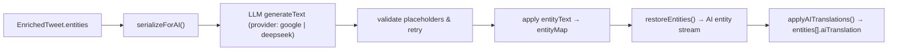

# 推文翻译与词典管理子系统设计文档 v2.1

> 本文档描述 **Anon Tweet** 当前（2026-04）翻译子系统的真实数据流向、关键约束与模块职责。

## 1. 概述 (System Overview)

推文翻译子系统是 Anon Tweet 项目的核心业务模块之一，旨在为用户提供对推文内容（Text Entities）进行本地化重构的能力。该系统结合了 **Google Gemini / DeepSeek 双 AI 提供商** 的自动化翻译能力与 **人工编辑** 的精确控制，采用 **客户端主导 (Client-First)** 的状态管理策略。

本模块主要包含四个核心领域：

1. **AI 自动翻译 (AI Auto-Translation)**：基于 Vercel AI SDK 和多提供商（Google Gemini / DeepSeek）进行结构化输出翻译，并在服务端生成可渲染的翻译实体。
2. **翻译编辑器 (Translation Editor)**：用户对实体级翻译进行人工校对、显示/隐藏管理。
3. **翻译视图解析 (Translation View Resolution)**：6 级决策链统一决定推文渲染时应展示的翻译内容。
4. **词典管理 (Dictionary Manager)**：维护本地术语表，用于 AI 提示词注入及 UI 辅助补全。

### 1.1 术语与约束 (Terminology & Constraints)

- **Entity stream（实体流）**：`Entity[]` 按阅读顺序描述推文内容，包含 `text/hashtag/mention/url/media_alt/...` 等类型。
- **Translated stream（翻译实体流）**：AI 翻译后重新构建的一套 `Entity[]`，允许占位符实体（hashtag/url/mention 等）在译文中 **重排** 以适配中文语序。
- **Overlay translation（覆盖式翻译）**：在不改变实体流结构的前提下，将 `translation` 或 `aiTranslation` 字段回填到原始实体中。
- **占位符 (Placeholder)**：AI 输入中把不可翻译实体替换为 `<<__TYPE_INDEX__>>`，AI 输出必须原样保留。

---

## 2. 领域模型 (Domain Model)

### 2.1 推文实体扩展 (Extended Entities)

```typescript
// app/types/entities.ts
interface EntityBase {
  text: string
  translation?: string      // 手动翻译（用户编辑）
  aiTranslation?: string    // AI 翻译（v2.1 新增，替代 autoTranslationEntities）
  index: number
}
```

**关键变更 (v2.1)**：
- **`aiTranslation` 字段**：AI 翻译结果现在直接嵌入到每个实体的 `aiTranslation` 字段中，与手动翻译 `translation` 共存。
- **`autoTranslationEntities`** 标记为遗留字段（Legacy），已有逻辑完成迁移兼容，新代码不应再使用。
- 实体数组保持只读；翻译内容通过 `TranslationStore` 和 `aiTranslation` 字段管理。

### 2.2 实体类型扩展

```typescript
// app/types/entities.ts
type EntityType = 'text' | 'hashtag' | 'mention' | 'url' | 'media_alt' | 'symbol' | 'prepend' | 'card' | 'media'
```

`media_alt` 类型实体现在也支持 `translation` 和 `aiTranslation` 字段，用于媒体替代文本的翻译。

### 2.3 翻译状态 (Translation State)

在 `TranslationStore` 中，翻译状态具有三态逻辑：

- **`undefined`**: 未进行人工编辑（默认状态，按 6 级决策链自动选择显示内容）。
- **`Entity[]`**: 已存在人工翻译/编辑内容（最高优先级）。
- **`null`**: 用户显式隐藏翻译（强制显示原文，忽略所有翻译）。

对应实现文件：`app/lib/stores/translation.ts`

### 2.4 翻译设置 (Settings Configuration)

```typescript
// app/lib/stores/appConfig.ts
interface AIConfig {
  aiProvider: 'google' | 'deepseek'           // v2.1 新增：AI 提供商选择
  enableAITranslation: boolean                 // 是否开启 AI 自动翻译

  // Gemini 配置
  geminiApiKey: string
  geminiModel: string                          // e.g., "models/gemini-3-flash-preview"
  geminiThinkingLevel: ThinkingLevel           // minimal | low | medium | high | max

  // DeepSeek 配置 (v2.1 新增)
  deepseekApiKey: string
  deepseekModel: string                        // e.g., "deepseek-v4-flash"
  deepseekThinkingLevel: ThinkingLevel

  // 翻译显示风格
  translationGlossary: TranslationGlossaryItem[] // 术语表（用于 AI 提示词注入）
}
```

**思考强度级别** (`ThinkingLevel`): `minimal | low | medium | high | max`

- **Gemini**: `level` 映射到 `thinkingBudget`：minimal→0, low→1024, medium→4096, high→16384, max→32768
- **DeepSeek**: `level` 映射到 `reasoning_effort`：minimal→disabled, high→high, max→max

```typescript
// app/lib/stores/translation.ts (SettingsSlice)
interface TranslationSettings {
  enabled: boolean
  customSeparator: string
  selectedTemplateId: string
  filterUnrelated: boolean         // v2.1 新增
  customTemplates: SeparatorTemplate[]
}
```

**预设分隔符模板** (`DEFAULT_TEMPLATES` 在 `app/lib/constants.ts`):
- "谷歌翻译风格" — 品牌色 `#4285F4`
- "Gemini 翻译风格" — 品牌色 `#4285F4`
- "DeepSeek 翻译风格" — 品牌色 `#4D6BFE` (v2.1 新增)
- 预设模板不再持久化，每次从常量初始化；用户自定义模板（`custom-{timestamp}`）持久化至 localStorage。

---

## 3. 状态管理架构 (State Management Architecture)

### 3.1 翻译业务 Store (`useTranslationStore`)

- **生命周期**: 会话级 (Session-based)，设置项持久化 (persist v6)。
- **存储版本**: v6（从 v5 迁移：清理 `separatorTemplates` 从 settings 内部移至根级别，`translationMode` 与 `settings` 平级持久化）。
- **核心职责**:
  1. **多级回退策略 (Fallback Strategy)**: 由 `resolveTranslationView.ts` 的 6 级决策链统一管理（见第 5 节）。
  2. **显式隐藏支持**: `setTranslation(tweetId, null)` 动作允许用户针对特定推文关闭翻译显示。
  3. **AI 翻译回填**: `updateTweet(tweetId, updates)` 允许将 AI 翻译结果直接回填到 Store 中的推文实体。
  4. **数据同步**: `setTranslation` 只更新 `translations` 查找表；渲染/导出/同步时通过纯函数 `materialize` 将翻译覆盖到原文实体流。
  5. **兼容性迁移**: `processTweetsForStore()` 自动将旧 `autoTranslationEntities` 迁移至 `entities[].aiTranslation`。

### 3.2 配置 Store (`useAppConfigStore`)

- **存储版本**: v4（新增 `aiProvider`、`deepseekApiKey`、`deepseekModel`、`deepseekThinkingLevel` 字段）。
- **`useAIConfig()` 选择器**: 聚合所有 AI 提供商相关字段，供组件和 API 调用使用。

### 3.3 词典持久化 Store (`useTranslationDictionaryStore`)

- **功能**: 管理用户自定义术语表。
- **AI 集成**: 词典内容会被序列化后作为 System Prompt 的一部分发送给 LLM，以提高特定领域名词（如二次元黑话、技术术语）的翻译准确度。

---

## 4. 核心业务逻辑 (Core Business Logic)

### 4.1 AI 自动翻译工作流（服务端）

为了解决 LLM 翻译过程中破坏推文实体的问题，系统设计了一套**占位符序列化机制**。

**实现文件**：

- AI 翻译入口：`app/lib/AITranslation.ts`（支持 `google` / `deepseek` 双提供商）
- 占位符序列化/还原：`app/lib/react-tweet/utils/entitytParser.ts`
- 翻译结果合并：`applyAITranslations()` — 将 AI 翻译按 `index` 精准合并回原始实体数组
- API 路由：
  - `POST /api/tweet/get/:id`：`app/routes/api/tweet/get.ts`（拉取推文并可选服务端翻译）
  - `POST /api/ai-translation`：`app/routes/api/ai/ai-translation.ts`（仅翻译单条推文，支持 `force: true` 强制重翻译）

**流程**：

1. **序列化 (serializeForAI)**：把不可翻译实体替换为占位符 `<<__TYPE_INDEX__>>`，得到 `maskedText + entityMap`。
2. **上下文构建**：构造 system/user prompt（作者信息、引用推文、术语表、实体引用上下文）。
3. **结构化生成**：调用 `generateText()` 并强制 JSON 输出（Zod schema 校验），返回：
   - `translation`：译文字符串（必须保留占位符）
   - `entityText?`：可选，hashtag/symbol 的显示文本覆盖（禁止 mention）
4. **校验/重试**：占位符缺失/多余会触发一次重试；`entityText` 类型越权会触发重试。
5. **应用覆盖**：将 `entityText` 写回 `entityMap`（不改变占位符本身，只改变最终渲染显示文本）。
6. **还原 (restoreEntities)**：将译文字符串解析为翻译实体流。
7. **合并 (applyAITranslations)**：将翻译实体按 `index` 合并回原始实体数组的 `aiTranslation` 字段。



### 4.2 多提供商差异性处理

```typescript
// app/lib/AITranslation.ts — getThinkingConfig()
function getThinkingConfig(provider, level, modelConfig) {
  if (provider === 'google') {
    // type: 'level' → thinkingLevel + thinkingBudget 映射
    return { thinkingLevel, thinkingBudget: mapLevelToBudget(level) }
  }
  if (provider === 'deepseek') {
    // type: 'enabled' + reasoningEffort 映射
    const enabled = level !== 'minimal'
    const effort = level === 'max' ? 'max' : 'high'
    return { thinking: { type: enabled ? 'enabled' : 'disabled' }, reasoningEffort: effort }
  }
}
```

### 4.3 实体级人工编辑

允许用户在 AI 翻译的基础上进行二次修改。

- **逻辑实现**: `app/components/translation/TranslationEditor.tsx` / `app/hooks/use-translation-editor-logic.ts`
- **特性**:
  - **三优先级回填**:
    1. 优先级 A：TranslationStore 中本地保存的手动翻译
    2. 优先级 B：推文自带的 AI 翻译（`entities[].aiTranslation` 字段）
    3. 优先级 C：兼容旧数据的 `autoTranslationEntities` 数组
  - **手动触发重翻译**：编辑器内的 AI 翻译按钮默认带上 `force: true`，支持按当前选定的提供商和模型重新翻译。
  - **实时回填**：AI 翻译结果通过 `updateTweet()` 回填到全局 Store，无需刷新页面即可看到效果。
  - **重置 (Reset)**: 恢复到初始状态（清除人工编辑，回退到 AI 翻译或原文）。
  - **隐藏 (Hide)**: 强制显示原文，屏蔽 AI 翻译。
  - **句首补充**: 支持插入额外的上下文说明（Prepend Entity）。

### 4.4 备选翻译编辑器 (Alt Translation)

- **实现文件**: `app/components/translation/AltTranslationEditor.tsx` / `app/hooks/use-alt-translation-logic.ts`
- **功能**: 专门处理 `media_alt` 类型实体的翻译，同样支持双提供商和 AI 翻译回填。

### 4.5 纯净模式与截图支持

针对 `plain-tweet/:id` 路由（用于服务端截图或纯净阅读）：

- **参数控制**: 支持通过 Query 参数 (`?translation=true/false`) 控制服务端渲染时的翻译显示策略。
- **数据获取**: `clientLoader` 会根据配置尝试获取带翻译实体的数据，确保截图内容包含最新的 AI 翻译结果。

---

## 5. 翻译视图解析器 (Translation View Resolver)

### 5.1 `resolveTranslationView.ts` — 6 级决策链

v2.1 新增的核心模块，统一决定推文渲染时应展示什么翻译内容。解决了之前多处重复实现 Fallback 逻辑的痛点。

**决策优先级**（`app/lib/translation/resolveTranslationView.ts`）：

| 优先级 | 条件 | 行为 |
|--------|------|------|
| 1. Mode Gate | `translationMode === 'original'` | 直接返回原文 |
| 2. Visibility Gate | `visibility[body/alt]` 检查 | 若不可见则跳过翻译 |
| 3. Manual Override | `translations[tweetId]` 为 `Entity[]` | 使用手动翻译（最高优先） |
| 4. New AI Translation | `entities[].aiTranslation` 存在 | 使用新版 AI 翻译字段 |
| 5. Legacy AI Translation | `tweet.autoTranslationEntities` 存在 | 兼容旧的独立数组 |
| 6. Legacy Embedded | `entities[].translation` 存在 | 兼容旧的手动翻译 |
| 7. Original Fallback | 以上均不满足 | 返回原文 |

### 5.2 `resolveEntities.ts` — AI 翻译合并工具

v2.1 新增的纯函数模块，提供通用的翻译实体合并能力：

- **`mergeTranslationsToField(base, translated, field)`**: 通用合并函数，将翻译实体按 `index` 匹配到 `translation` 或 `aiTranslation` 字段
- **`shouldRenderTranslatedEntitiesDirectly()`**: 判断 AI 结果是否为"翻译实体流"（需直接渲染而非 overlay）
- **`resolveAIEntitiesForDisplay()`**: 核心决策函数，根据 AI 结果的结构决定渲染策略

### 5.3 `materialize.ts` — 导出/同步的翻译视图

由于 Store 中的人工翻译不再写回 `tweet.entities`，导出/同步等场景需要显式生成"带翻译字段的 tweet 视图"：

- 纯函数实现：`app/lib/translation/materialize.ts`
- 使用位置：
  - Markdown 导出：`useTweetOperations()`
  - 截图后同步到 DB：`useScreenshotAction()` → `syncTranslationData(tweets, translations)`

---

## 6. 交互设计与 UI 模块

### 6.1 翻译显示组件 (`TranslationDisplay`)

- **智能展示**: 自动判断显示逻辑（通过 `resolveTranslationView` 决策链）。
- **视觉反馈**: 分隔符使用当前选中的模板样式（含提供商品牌色）。

**当前渲染链路**：

- 原文：`app/components/tweet/TweetTextBody.tsx` → `TweetBody(isTranslated=false)`
- 译文：`app/components/translation/TranslationDisplay.tsx` → `useTweetTranslation()` → `resolveTranslationView()` → `TweetBody(isTranslated=true)`
- 媒体 Alt 翻译：`app/components/tweet/TweetMediaAlt.tsx` — 支持原文/译文/双语三种模式

### 6.2 设置面板

- **AI 翻译设置** (`app/components/settings/AITranslationSettings.tsx`):
  - 提供商选择器（Google Gemini / DeepSeek 二选一）
  - 根据所选提供商动态切换 API Key / 模型 / 思考强度配置
  - 内置连通性测试按钮，自动适配当前提供商
- **模板管理** (`app/components/settings/SeparatorTemplateManager.tsx`):
  - 预设模板不可变更
  - 支持添加/编辑/删除自定义翻译分隔符模板
- **词典管理** (`app/components/settings/TranslationDictionaryManager.tsx`):
  - Excel 导入/导出术语表
  - 可视化编辑界面

### 6.3 推文选项菜单

新增单条推文级别的翻译控制（`app/components/tweet/TweetOptionsMenu.tsx`）：
- 翻译按钮显隐切换
- 媒体排列方式切换（宫格/竖向）

---

## 7. 技术栈依赖

- **AI Runtime**: `ai` (Vercel AI SDK), `@ai-sdk/google`, `@ai-sdk/deepseek` (v2.1 新增)
- **State**: `zustand` (with `persist` middleware, v5 core / v6 storage)
- **Data Fetching**: `swr` (配合 React Router loader)

---

## 8. 安全与隐私

1. **API Key 安全**: 用户输入的 API Key 仅存储在本地浏览器 LocalStorage 中，或通过服务器端环境变量注入（用于公共部署）。
2. **结构化输出**: 服务端强制 JSON schema，降低"多余文本/思考 token"污染下游解析的风险。
3. **中文跳过**: 对于已存在 `aiTranslation` 的中文推文，跳过 AI 翻译请求，节省 Token。
4. **双 Key 隔离**: Google 和 DeepSeek 的 API Key 独立存储、独立使用，互不干扰。

---

## 9. 性能与缓存策略 (Performance & Caching)

### 9.1 DB 缓存

- 推文主体缓存：`tweet.jsonContent`（包含完整 `EnrichedTweet` 含 entities）
- 人工翻译缓存：`tweet_entities.entities`（按 index 覆盖式回填）

### 9.2 Local Cache

- 推文通过 `getLocalCache()` 命中时，缓存快照可能不包含最新翻译。
- AI 翻译完成后主动刷新缓存（`setLocalCache(type='tweet')`），避免重复翻译。

### 9.3 Markdown 导出 — 三源翻译支持

`app/lib/markdown.ts` 支持三重翻译源输出：
1. `item.translation` — 手动翻译（`**Translation:**`）
2. `item.aiTranslation` — 新版 AI 翻译（`**AI Translation:**`）
3. `tweet.autoTranslationEntities` — 旧版兼容（`**AI Translation:**`）

媒体 Alt 实体翻译同样纳入导出流程。

---

## 10. 当前痛点与重构边界 (Problems & Refactor Boundaries)

### 10.1 已解决的痛点 (v2.1)

| 痛点 (v2.0) | 解决方案 (v2.1) |
|-------------|----------------|
| 合并逻辑分散、假设不一致 | `resolveTranslationView.ts` 统一 6 级决策链 |
| 数据形态混用 (overlay vs stream) | `resolveEntities.ts` 统一合并策略 |
| 仅支持 Google Gemini | 完整双提供商架构（Google + DeepSeek） |
| `autoTranslationEntities` 与 entities 分离存储 | 迁移至 `entities[].aiTranslation` 字段 |
| 预设模板污染 localStorage | 预设不再持久化，仅自定义模板存储 |

### 10.2 当前痛点

- **编辑器当前以"原始实体结构 Overlay"为主**：对于 AI 生成的"翻译实体流"（结构与原文不同），编辑器尽力回填但可能对齐不完美。
- **跨层耦合**：AI 输出契约的变化（如 tag 翻译、占位符重排）仍会直接影响 UI 解析/渲染与缓存同步。
- **性能抖动**：在无 DB 或 DB 未命中时，本地缓存可能缺少翻译字段，导致重复触发 AI 翻译。
- **DeepSeek 思考模式**：`low`/`medium` 级别被映射为 `high`（DeepSeek API 限制仅支持 disabled/high/max 三档）。

### 10.3 推荐下一步

1. **编辑器适配翻译流渲染**：允许编辑器中直接显示/编辑 AI 生成的翻译实体流，而非强制 overlay 合并。
2. **翻译结果缓存与 Snapshot**：缓存包含完整 `aiTranslation` 的快照，减少重复翻译。
3. **Provider 抽象接口化**：将 Google/DeepSeek 的差异性进一步封装为 Provider 接口，降低 `AITranslation.ts` 的条件分支复杂度。
